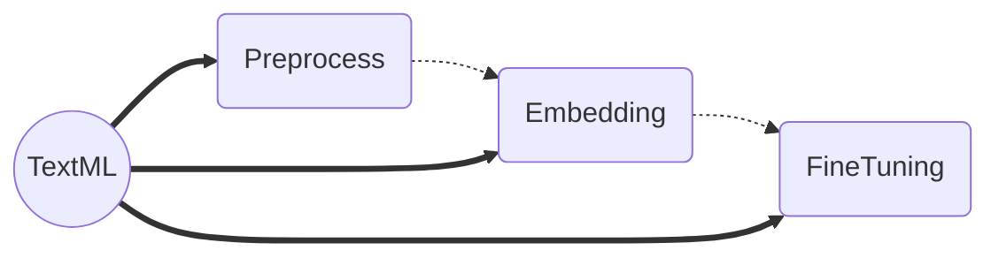

# Welcome to TexML!

This is the natural langauge processing (NLP) part of EvoML platform. Also, the below [flow chart](https://mermaid.js.org/intro/) displays the structure of TexML:



# Testing

All the configurarion we performe for the **pytest** package, you can find inside the `pyproject.toml`  file. There are many [plugins](https://docs.pytest.org/en/7.1.x/reference/plugin_list.html) which pytest supports, but we applied the below ones.

```bash
plugins: instafail-0.4.2, xdist-3.1.0, html-3.2.0, clarity-1.0.1, aggreport-0.1.5, colordots-1.1, sugar-0.9.6, cov-4.0.0, repeat-0.9.1, metadata-2.0.4, anyio-3.6.2, benchmark-4.0.0
```

For the performance test there are below plugins.
 - [ ] [pytest-durations](https://pypi.org/project/pytest-durations/)
 - [ ] [pytest-timer](https://pypi.org/project/pytest-timer/)
 - [ ] [pytest-performance](https://pypi.org/project/pytest-performance/)
 - [x] [pytest-benchmark](https://pypi.org/project/pytest-benchmark/) 

Furthermore, you can see all the **pytest** result, by opening the `result.html` file in the browser. And, we used the the below options for our pytest running configuration:

```bash
addopts = "-n2 --instafail --cov --cov-report html --cov-report term-missing --cov-fail-under 95 --benchmark-histogram -rxXs --count 1 --html=report.html --self-contained-html --capture=sys"
```